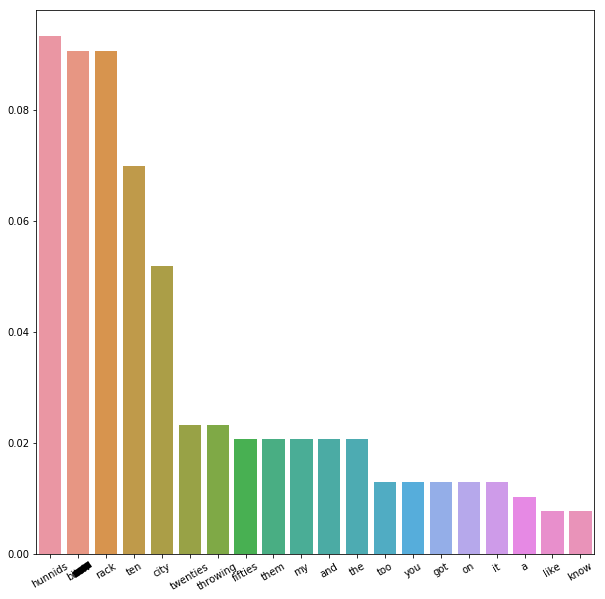
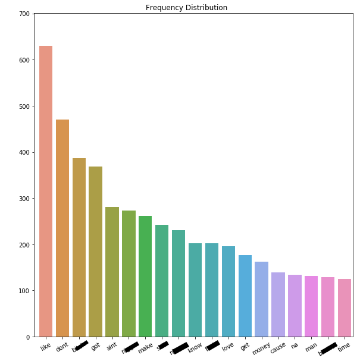

# Rap Generator
RNN for generating rap lyrics by Darius Fuller
 
## Background
I am someone who *loves* to music. One of my favorite genres to listen to is hip-hop/rap because of, in most cases, the focus on lyricism. 

In recent years, with the popularity of songs classified as "[mumble rap](https://en.wikipedia.org/wiki/Mumble_rap)" there has been less of a focus in this regard, leading some fans of "true hip-hop" to look down upon the musicians currently in the spotlight. Part of the criticism of modern rap can often center around how forgettable the lyrics and songs are due to their simplistic nature. 

While learning about *recurrent neural networks* (RNNs)I came across a [video](https://www.youtube.com/watch?v=ZMudJXhsUpY) by Laurence Moroney explaining how AI can be used to generate poetry after training upon a corpus of Irish poems. This sparked an idea to try and do the same with modern rap lyrics. I specifically decided to choose this genre because of my familiarity with it and thinking that the songs may be more wordy since the artists often are not singing any melodies.

To add a twist, I wanted to go about my data collection in an intentionally biased manner in this case so that the results may mimic the source material as much as possible. However, I will try to maintain some sort of randomness in the generated text, so overfitting wil be a big concern during training.

**DISCLAIMER:** *The Jupyter Notebook in this repository contains the explicit lyrics from the songs used to train this network. If this is an issue, please continue here. I apologize for the inconvenience.*

## Results
Since this project was more about the implementation of a RNN to generate text, I felt it best to use [Streamlit.io](streamlit.io) as a way to share my results in an interactive way. The GitHub repository for the app can be found [here](https://github.com/dfuller22/Rap_Generator_Streamlit). Once connected to the app, one will be able to input their own text and have my model attempt to continue as if the input text is part of a rap. [Try it out!](https://share.streamlit.io/dfuller22/rap_generator_streamlit/main/rap_gen.py)

## Packages
* requests==2.23.0
* regex==2020.6.8
* pickle==0.7.4
* pandas==0.23.4
* numpy==1.16.5
* tensorflow==2.2.0
* seaborn==0.9.0
* matplotlib==3.0.2
* nltk==3.4.5
* beautifulsoup4==4.7.1
* importlib-metadata==0.23
* custom functions (see functions.py in repository)

## Datatset Creation
#### Gathering the Data
In order to get all of the lyrics together as one package, I needed to scrape in two steps:
1. Get the links to the songs themselves
2. Get the songs via the links from Step 1

Step 1 can be completed using the BeautifulSoup4 API and a for-loop. Step 2 required a custom function that scraped songs and stored them in a time-delayed manner, allowing me to avoid DDoS filters. In total I was able to collect 180 songs to train the RNN with.
#### Prepping the Data
Some of the songs I collected included other artists in the lyrics, so I found a way using BeautifulSoup4 to separate the lyrics within a song depending on who was speaking. This was in an effort to ensure that the *only* lyrics the RNN sees are directly from Tyga, although I did train another model using the full collection of lyrics. 

Roughly speaking my process for the EDA was as follows:
1. Separate out lyrics without any featured artists by song title using a for-loop
2. Remove any non-Tyga lyrics via the headers using `lyric_header_checker()` and `lyric_header_filter()`
3. Split the lyrics into a list of strings line by line according to the song structure using `lyric_line_splitter()`
4. Remove punctuations, symbols, and lowercase all the lyrics using a regular expression within `song_cleaner()`
5. Tokenize the lyrics using NLTK's `word_tokenize()`

## EDA
#### Rack City
I decided to investigate some of the songs individually to see if there could be anything of note to find. When looking at the frequency distribution for the song [Rack City](https://en.wikipedia.org/wiki/Rack_City), I was able to quantify how repetitive it was in a sense. The frequency distribution created from the lyrics showed that the three words primarily used within the chorus took up of ~35% of all words used despite representing ~2% of the total vocabulary in the song.



#### All Solo Songs
Taking a similar approach to the individual songs, but over the entire set of solo songs, I was about to find out a few things about Tyga's tendencies.
* He uses a word denoting the first person ("I" or "I'm") ~26% of the time
* Otherwise, Tyga is talking directly to another ("you" is 4th most frequent word)
* At a rate of ~3.5%, "don't" is his favorite contraction to use
* The *B-word* is his favorite curse word, with a usage rate of ~2.9%


Top 5 words by frequency:
1. "I" ---> ~10.2%
2. "the" ---> ~10.2%
3. "a" ---> ~7.6%
4. "you" ---> ~7.0%
5. "it" ---> ~6.7%

By frequency, I am not able to tell much about the topics Tyga to discusses, just how he tends goes about it.

#### N-Grams
Hoping to find out more about the phrases Tyga uses rather than single words, I ran a quick check on the frequency of both bigrams and trigrams over the entire dataset.

Top 5 Bigrams:
* ("in", "the") ---> ~0.40%
* ("make", "it") ---> ~0.31%
* ("i", "dont") ---> ~0.30%
* ("in", "my") ---> ~0.24%
* ("like", "a") ---> ~0.24%

Top 5 Trigrams:
* ('make', 'it', 'rain') ---> ~0.14%
* ('stop', 'stop', 'stop') ---> ~0.07%
* ('throw', 'it', 'up') ---> ~0.07%
* ('im', 'the', 's##t') ---> ~0.07%
* ('it', 'rain', 'trick') ---> ~0.07%

From the top bigrams we see how he tends to structure his wordplay using "like a" to create similes. This leads me to belive that "i dont", "in the", and "in my" are likely candidates to start off each idea, ending with "like a" to finish it off. EX: "*i dont* dance *in the* club *like a*.." 

The top trigrams did not reveal much more about Tyga's lyrical tendencies. They refer to song titles or the choruses within them, which may indicate how he uses short phrases for these components. Overall, there is not a clear "tell" with respect to trigrams of a Tyga song since the highest frequency sits so low.

#### Stopwords Out
Building out my analysis, I wanted to remove the [stopwords](https://en.wikipedia.org/wiki/Stop_word) from the lyrics and see what the remaining information can tell me about the rapper.



Simply put, he cusses often and uses words in reference to other men/women, money and love.

#### Statistics
In addition to my analysis on the lyrics themselves, I wanted to see what kind of information can be found by treating each song as a document itself. For code brevity, I created the custom function `song_stat_df_generator()` that will take in a dictionary of lyrics and output a Pandas' DataFrame with each song's:
* Title
* Total words used
* Total unique words used
* Unique to total word ratio
* Averages for the whole dataset in the above areas

The averages are:

| Metric    | Value |
|:---------:|:-----:|
| Total     | 408.5 |
| Unique    | 181.3 |
| U/T Ratio | 0.47  |

Here is the distribution of songs based upon the unique to total ratio, which interestingly has a slight skew to the left.


## Creating the RNN
Keeping with the inpsiration for the project, I followed the guidelines laid out [here](https://www.tensorflow.org/tutorials/text/text_generation) by Tensorflow when prepping my data. I did do a few things differently to match the amount of data and the hardware I was using at the time. In short, I:
* Created lookup tables for indices and their corresponding character values
* Converted the lyrics into integer sequences using the lookup tables
* Created target/input batches using the sequences for training

#### Architecture
Here is the final architecture I used for my model:

    Model: "sequential"
    _________________________________________________________________
    Layer (type)                 Output Shape              Param #   
    =================================================================
    embedding (Embedding)        (64, None, 256)           10752     
    _________________________________________________________________
    gru (GRU)                    (64, None, 1024)          3938304   
    _________________________________________________________________
    dense (Dense)                (64, None, 42)            43050     
    =================================================================
    Total params: 3,992,106
    Trainable params: 3,992,106
    Non-trainable params: 0
    _________________________________________________________________
    

#### Training Strategy
I wanted to be really careful about how long I trained the model so as to hopefully allow for some flexibility for the future and randomness in the current iteration's generated text. After the first 10 epochs, I stopped the training process to check what the output looks like given a simple phrase at multiple levels of complexity (referred to as *temperature* in the notebook). The current version trained for 35 epochs on all of songs, including those with featured artists, taking the scalar loss from ~3.7 to 0.48.

## Text Generation
Pre-Training prediction:
* Input: 
"or fake b"
* Predictions: 
"1jzptc 7to"
* Ouput: 
"or fake b1jzptc 7to"

Post-Training prediction:
```
print('Prediction Temperature 1.0:\n') ## 1.0 is highest level of temperature
print(generate_text(model_gen_fts, char_v_idx_fts, idx_v_char_fts, start_string='im like ', temp=1.0))
```
    Prediction Temperature 1.0:
    
    im like a drum
    real n#### b###### know my back round
    bring me oh oh hundreds hundreds the sound
    world around

#### Censorship
Given the nature of the lyrics that the model trained upon, it is no surprise that is also generates curse words. Therefore, in order for me to feel comfortable deploying this model, I decided to make a custom class that will censor out words after they have been predicted. This will allow for the model to still learn from the context and meaning of the words without having to be vulgar itself.

## Results
Overall, I am satisfied with the results. I was able to create a model that can mimick a rapper in a relative sense. Having ran numerous generations using this model, it is clear to me that the style of Tyga has been learned to with some respect by the model. It often will repeat the chorus of some of his songs if it gets "stuck" in a prediciton loop for example. In other cases, as shown above it pulls of a legitimate rhyme scheme covering a topic that Tyga would as well. 

#### Sreamlit App
I already have the code written up for the first iteration of a webapp that will allow users to input their own text to have the model generate from. At the moment I am waiting on an invitation to share it via the Streamlit platform. If this becomes a dead-end, I will investigate other routes.

#### Future Work
I would like to expand this model's training inputs to include other rappers so that I could create some "lunchroom special" version of their styles and/or lyrics. This would potentially move into allowing a user to predict like a rapper of their choosing or all of them.

### Questions?
Feel free to reach out to me on [Twitter](https://twitter.com/dariuslfuller) or [LinkedIn](https://www.linkedin.com/in/darius-fuller/). Thank you!